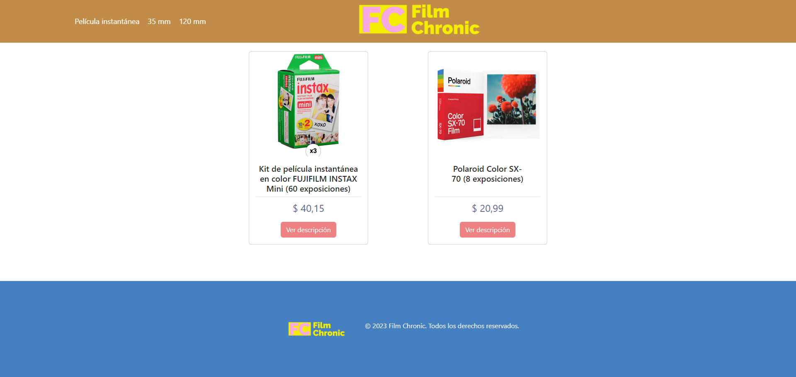
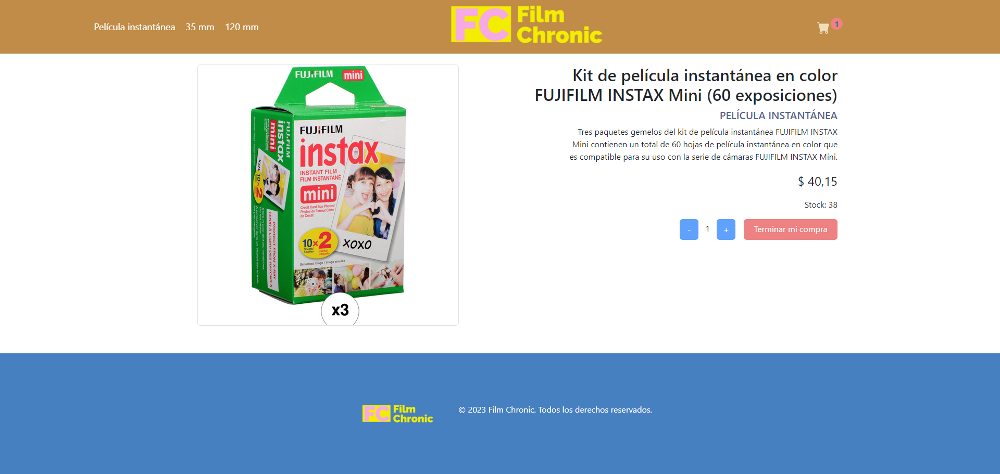
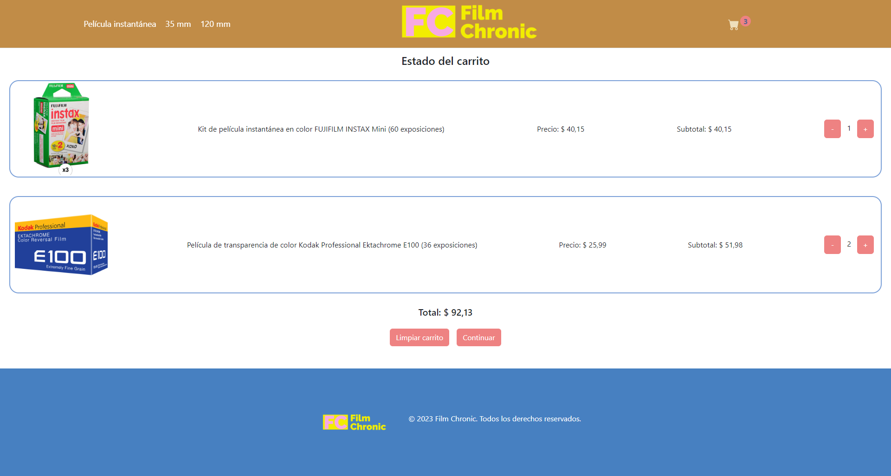

# React + Vite

This template provides a minimal setup to get React working in Vite with HMR and some ESLint rules.

Currently, two official plugins are available:

- [@vitejs/plugin-react](https://github.com/vitejs/vite-plugin-react/blob/main/packages/plugin-react/README.md) uses [Babel](https://babeljs.io/) for Fast Refresh
- [@vitejs/plugin-react-swc](https://github.com/vitejs/vite-plugin-react-swc) uses [SWC](https://swc.rs/) for Fast Refresh


# E-Commerce App Web con React.js

Bienvenido a la documentación de nuestro proyecto de e-commerce app web desarrollado con React.js. Este proyecto es una aplicación web moderna diseñada para facilitar la compra y venta de productos de manera intuitiva y eficiente. En esta ocasión, el proyecto a consistido en la creación de la tienda Film Chronic. Además, en la creación de este proyecto se utilizó firebase para la creación de una base datos para el catálogo de productos.

## Capturas de Pantalla

A continuación, algunas capturas de pantalla que muestran la interfaz de usuario de la aplicación:







## Características Principales

- **Catálogo de Productos:** Exhibe productos con detalles como imágenes, descripciones y precios. Además, se encuntran agrupados por categorías.
- **Carrito de Compras:** Facilita a los usuarios agregar productos al carrito y realizar compras.
- **Proceso de orden:** Formulario para el ingreso de datos del usuario de manera segura que permite realizar la orden de los productos deseados.


## Requisitos del Sistema

- Node.js
- npm (o yarn)

## Instalación

1. Clona el repositorio: `git clone https://github.com/tuusuario/tuproyecto.git`
2. Ingresa al directorio del proyecto: `cd tuproyecto`
3. Instala las dependencias: `npm install` o `yarn install`

## Configuración

Antes de ejecutar la aplicación, asegúrate de configurar correctamente las variables de entorno y cualquier otra configuración necesaria. Consulta el archivo `.env.example` para obtener un ejemplo.

## Uso

Ejecuta la aplicación en modo desarrollo:

```bash
npm start